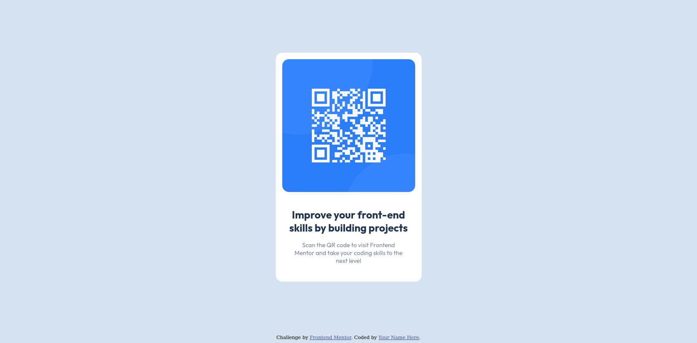

# Frontend Mentor - QR code component solution

This is a solution to the [QR code component challenge on Frontend Mentor](https://www.frontendmentor.io/challenges/qr-code-component-iux_sIO_H). Frontend Mentor challenges help you improve your coding skills by building realistic projects. 

## Table of contents

- [Overview](#overview)
  - [Screenshot](#screenshot)
  - [Links](#links)
- [My process](#my-process)
  - [Built with](#built-with)
  - [What I learned](#what-i-learned)
  - [Continued development](#continued-development)
  - [Useful resources](#useful-resources)
- [Author](#author)
- [Acknowledgments](#acknowledgments)

## Overview

A perfect first challenge if you're new to HTML and CSS. The card layout doesn't shift, so it's ideal if you haven't learned about building responsive layouts yet.

Users should be able to:

- View the optimal layout for the interface depending on their device's screen size
- See hover and focus states for all interactive elements on the page
- **Bonus**: Use the local JSON data to dynamically populate the content

### Screenshot

### Links

- Solution URL: [Repo](https://github.com/girldocode/qr-code-fr-mentor)
- Live Site URL: [Demo](https://qr-code-fr-mentor.vercel.app/)

## My process

### Built with

- Semantic HTML5 markup
- CSS custom properties
- Flexbox

### What I learned

...

### Continued development

.....

### Useful resources

- [MDN](https://developer.mozilla.org/en-US/)
- [Stackoverflow](https://stackoverflow.com/)

## Author

- Website - [website is comming...]()
- Frontend Mentor - [@girldocode](https://www.frontendmentor.io/profile/girldocode)
- Twitter - [@girldocode](https://www.twitter.com/girldocode)

## Acknowledgments

...
